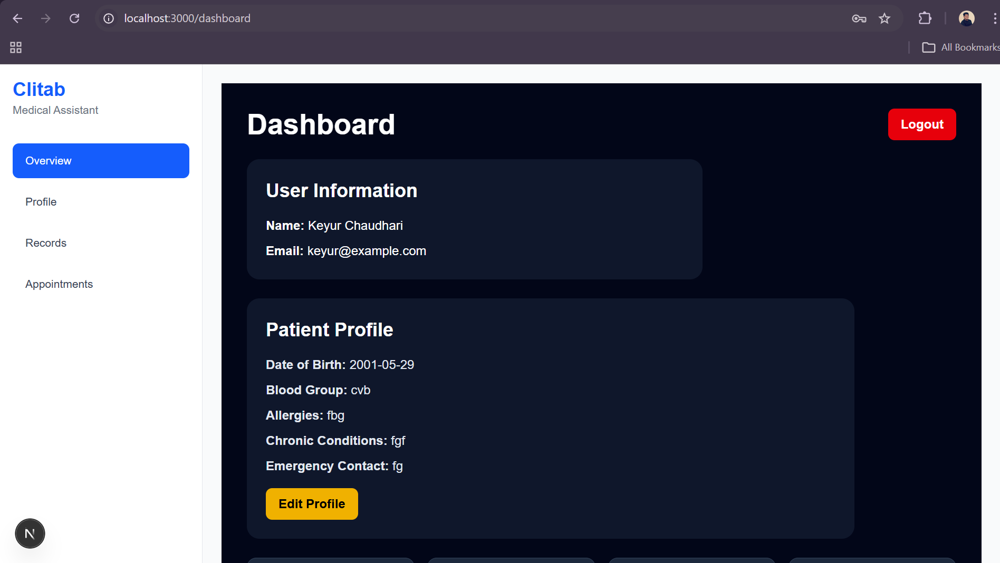
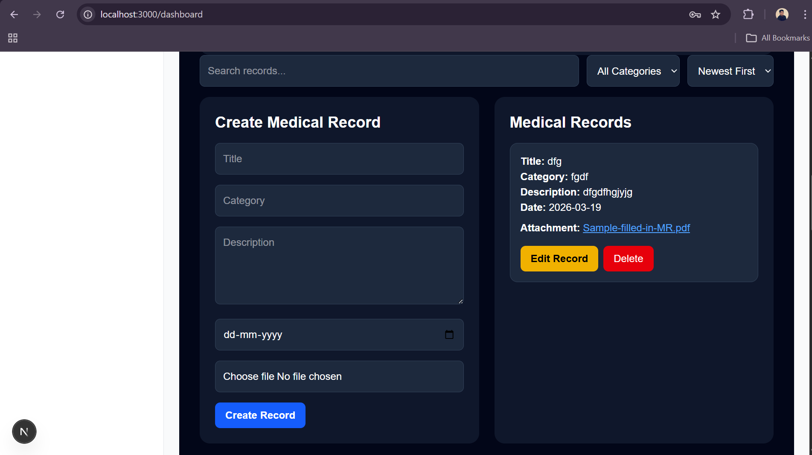
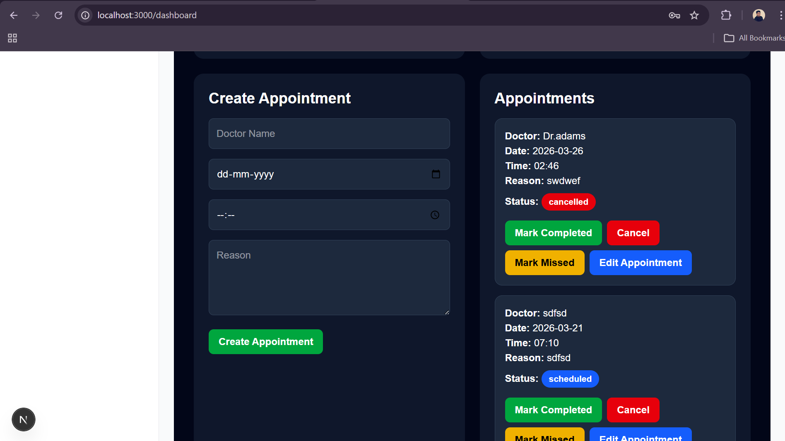

# Medical Assistant Dashboard (Clitab)

A full-stack medical assistant application that helps patients manage their medical records, appointments, and personal health information.

Built using **FastAPI**, **PostgreSQL**, and **Next.js**.

This project was developed as a **Final Year Software Engineering Project**.

---

## Features

### Authentication
- JWT-based login and registration
- Protected dashboard routes
- Secure session handling

### Patient Profile
- Create and update patient information
- Medical history tracking
- Emergency contact management

### Medical Records
- Create, edit, and delete records
- Upload medical reports to AWS S3
- View attachments directly from dashboard
- Search, filter, and sort records

### Appointment Management
- Schedule appointments
- Update appointment status
- Quick status buttons
- Appointment activity chart

### Dashboard
- Overview statistics
- Patient timeline view
- Appointment activity visualization
- Modular dashboard pages

---

## Tech Stack

### Frontend
- Next.js (App Router)
- TypeScript
- TailwindCSS
- Chart.js

### Backend
- FastAPI
- PostgreSQL
- SQLAlchemy
- JWT Authentication

### Storage
- AWS S3 for medical report uploads

---

## Project Structure

medical-assistant
│
├── backend
│ ├── app
│ ├── services
│ ├── main.py
│ └── requirements.txt
│
├── frontend
│ ├── public
│ ├── src
│ │ ├── app
│ │ ├── components
│ │ └── services
│ └── package.json
│
├── docs
└── README.md

---

## Installation

### Clone the repository

git clone https://github.com/keyurck7/clitab-medical-assistant.git

cd clitab

---

## Backend Setup

cd backend

python -m venv venv
venv\Scripts\activate

pip install -r requirements.txt

Run backend:

uvicorn app.main:app --reload

API documentation:

http://localhost:8000/docs

---
## Frontend Setup

cd frontend
npm install
npm run dev

Open:

http://localhost:3000
---

## Future Improvements
- Appointment calendar view
- Email notifications for appointments
- Doctor portal
- Role-based authentication
- Medical report preview
---

## Author
Keyur  

GitHub:  https://github.com/keyurck7

## Screenshots

### Dashboard

### Records

### Appointments

